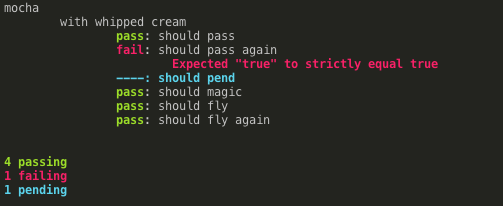

# mocha

Mocha/Chai inspired C++ test framework (BDD)


The original repository can be found [here](https://github.com/MadLittleMods/macchiato).

mocha strives to be as close and familiar as [mocha](http://mochajs.org/)/[chai](http://chaijs.com/).




## Usage

To use this library, install [buckaroo](https://github.com/LoopPerfect/buckaroo/wiki/Installation#buckaroo) and [buck](https://github.com/LoopPerfect/buckaroo/wiki/Installation#buck). Once installed, [initialize](https://github.com/LoopPerfect/buckaroo/wiki/Commands#init) buckaroo in your project folder and run the following command:

```bash
# Add the latest version
buckaroo add github.com/iwatakeshi/mocha/
# Install dependencies
buckaroo install
```


## Built-in Runner

mocha has a main function that you can use to remove some boilerplate from your testing code.

On the desktop platform, you can pass in command-line arguments/flags.

```cpp
// This tells mocha to provide a main function. Only do this in one source/cpp file
#define MOCHA_MAIN
#include "mocha.h"
using namespace mocha;

MOCHA_RUN_TESTS([] {
  describe("Foo", [&]() {
    describe("with bar", [&]() {
      it("should baz", [&]() {
        return expect(true).to->equal(true)->result();
      });

      // This test will fail because it is false != true
      it("should qux", [&]() {
        return expect(false).to->equal(true)->result();
      });

      // An `it` call without a callback is considered "pending"
      // In other words, the test still needs to written/implemented.
      it("should norf");
    });
  });
});
```

## Own `main`

You can also use your own `main` function. Check [`examples/example2.cpp`](https://github.com/iwatakeshi/mocha/blob/master/examples/example2.cpp) for a complete example

Just call the `describe`/`it` functions in your main loop or wherever. No need for the `MOCHA_RUN_TESTS` macro unless you want to do things there still.


## Details:

Requires C++11. Works on the following platforms:

 - Most desktop environments
 - Visual Studio

# API

| Test Function | Description  |
|----------------|--------------|
| `describe(string description, function<void> callback)`       | Describes the test suite and can be nested. |
| `it(string description)` |  Describes a pending test case.    |
| `it (string description, mocha_comparator<T, U> comparator)` 	| Describes a test case using a custom comparator. |
| `it (string description, function<bool(T, U)> comparator)` 		| Describes a test case using a custom comparator function. |

| Helper Function | Description |
|------------------|-------------|
| `string mocha::summary()` 			| Returns a summary of the test.
| `string mocha::print_summary()` | Outputs a summary of the test.
| `void mocha::clear()` 					| Clears the test output and resetes the test counts.

| Constructor | Description |
|--------------|-------------|
| `expect(T actual)` | Initializes an object of type `expect_t` that provides a [chainable](#BDD) API.

### Example

```cpp
#include <iostream>
#include "mocha.h"
using namespace mocha;

describe("Car", [&]() {
  
  // Test values with the same type.
  it("should have 4 wheels", [&]() {
    return expect(Car().getNumWheels())).to->equal(4)->result();
  });

  // Test values with different types
  it("should fail", [&] () {
    return expect(Car().hasEngineStarted()).to->equal("true")->result();
  });

  // Test values with same or different types using a mocha comparator
  it("should have foor doors 4 doors. (mocha comparator)", [&] () {
    auto comparator = mocha_comparator<Car, int>([&] (Car a, int b) {
      return a.getNumDoors() == b;
    });
    return expect(Car()).to->equal(4, comparator)->result();
  });

  // Test values with same or different types using a comparator function (lambda).
  it("should have foor doors 4 doors. (comparator function)", [&] () {
    auto comparator = [&] (Car a, int b) {
      return a.getNumDoors() == b;
    });
    return expect<MyCar>(Car()).to->equal<int>(4, comparator)->result();
  });
});

mocha::print_summary();
```


## BDD

Behaviour driven development (BDD)

 - `expect`
    - `expect(actual).then->then->then->equal(expected)->result();`

## Language Chains

Provided as chainable getters to improve the readability of your assertions. They do not provide testing capabilities.

 - `to`
 - `be`
 - `been`
 - `is`
 - `that`
 - `which`
 - `then`:
    - *substitute for `and` because `and` is a reserved keyword in C++*
 - `has`
 - `have`
 - `with`
 - `at`
 - `of`
 - `same`

## Chainable Test API

These provide actual functionality in the chain.

| Member   | Alias(s)  | Description | Example  |
|--------|--------|-------------|----------|
| `never`|        | Negates any of assertions following in the chain. *substitute for `not` because `not` is a reserved keyword in C++* | `expect(3).to->never->equal->(3)->result();` |
| `equal(U value)`| `eql(...)` | Asserts that the target loosely equals (==) to `value`. | |
| `equal(U value, mocha_comparator comparator)`| `eql(...)` | Asserts that the target loosely equals (==) to `value`. | |
| `equal(U value, comparator_lambda comparator)`| `eql(...)` | Asserts that the target loosely equals (==) to `value`. | |
| `strict_equal(U value, (mocha_comparator or comparator_lambda) comparator?)` | `seql(...)` | Asserts that the target strictly equals (==) to `value`. | |
| `strict_equal(U value, mocha_comparator comparator)`| `seql(...)` | Asserts that the target strictly equals (==) to `value`. | |
| `strict_equal(U value, comparator_lambda comparator)`| `seql(...)` | Asserts that the target strictly equals (==) to `value`. | |
| `close_to(double expected, double tolerance)` | | Asserts that the target is equal to `expected`, to within a +/- `tolerance` range. | |
| `within(double lower, double upper)`         | | Asserts that the target is within a range. | |
| `above(double value)` | `gt(...)`, `greater_than(...)`| Asserts that the target is greater than `value`. | |
| `least(double value)` |`gte(...)` |Asserts that the target is greater than or equal to `value`. | |
| `below(double value)` | `lt(...)`, `lessThan(...)` | Asserts that the target is less than `value`. | |
| `most(double value)`| `lte(...)` | Asserts that the target is less than or equal to `value`. | | 
| `satisfy(function<bool, T> test, function<string, T, expect_flags> fail?)` | | Asserts that the target passes a given truth test. | |
| `satisfy(mocha::mocha_plugin plugin, U expected)` | | Asserts that the target passes a given truth test. | |
| `satisfy(bool test_result_bool, string fail_message)` | | Asserts that the target passes a given truth test. | |

## Plugins

Plugin-like functionality is supported via `mocha::mocha_plugin` which can be used in `expect().satisify(mocha::mocha_plugin plugin, U expected)`.

```cpp
mocha_plugin<typename T, typename U = T>(
  function<bool, T, U> lambda_test,
  function<string, T, U, test_flags> lambda_fail
);
```

### Example

```cpp
#include "mocha.h"
using namespace mocha;

// For `fmod` (used in the example plugin)
#include <math.h>

auto plugin_does_divide_evenly = mocha_plugin<double>(
  [&](double actual, double expected) {
    return fmod(expected, actual) == 0;
  },
  [&](double actual, double expected, test_flags flags) {
    return string("Expected ") + string(actual) + " to " + (flags.negate ? "not " : "") + "divide evenly into " + string(expected) + " but got a remainder of " + string(fmod(expected, actual));
  }
);

describe("Some numbers", [&]() {
  it("should divide evenly into other numbers", [&]() {
    return expect(2.0).to->satisfy(plugin_does_divide_evenly, 10.0)->result();
  });
});
```

# Options:

  - `mocha::mocha_settings`
    - `use_color`: bool - whether to add ANSI escape codes for colored text. (Supported in many consoles)
       - Default: `true`
       - If you are wanting to have colored Text in Windows (CMD prompt), follow this guide [*Using libuv with Windows and Visual Studio: Getting Started* by Eric Eastwood](http://ericeastwood.com/blog/24/using-libuv-with-windows-and-visual-studio-getting-started)
    - `indentation`: string - The indentation string/token every time we go a level deeper
       - Default: 2 spaces


# CLI flags

If you are using the mocha main runner these commands will be parsed automattically.

 - `--no-color`: Remove the ANSI color escape codes from the resultant output (plain text)

If you are using your own `int main()` (default) and want to have mocha parse the commands, just pass in `argc` and `argv` to `mocha::parse_cli_args(argc, argv)`.

```cpp
int main (int argc, char * const argv[]) {
  // Parse the incoming arguments
  mocha::parse_cli_args(argc, argv);

  // Do some tests... describe(...) { it(...) {}; };

  // Output the test results
  mocha::print_summary();
};
```


# Differences from mocha.js

We strive to make the API syntax the same between mocha and mocha. Some sacrifices had to be made for C++.

We currently do not support the full mocha.js API. Missing TDD and some BDD `expect` members.

 - Some member names used in mocha are reserved keywords in C++ which needed to be renamed
    - `then`(mocha C++) is equivalent to `and`(mocha JS)
    - `never`(mocha C++) is equivalent to `not`(mocha JS)
 - Inline function declaration syntax difference
    - mocha C++: `[&](){ /*...*/ }`
    - mocha JS: `function() { /*...*/ }`
 - Test chaining syntax is different
    - mocha C++: `expect(3).to->equal(3)->result();`
    - mocha JS: `expect(3).to.equal(3);`
